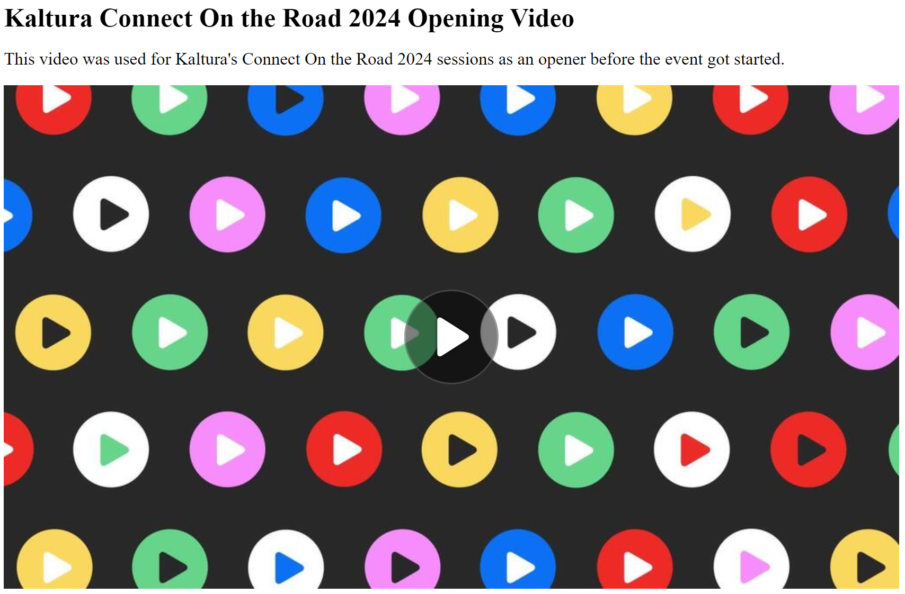

# Player API Hooks
Sometimes, you may need to take advantage of the Kaltura Player API to perform certain actions, or retrieve certain information.  You can find the most current information on the Kaltura Player in Github at https://github.com/kaltura/kaltura-player-js, and specifically the Player API at https://github.com/kaltura/kaltura-player-js/blob/master/docs/api.md.  There are also some more descriptive overviews that can be found at https://developer.kaltura.com/player/web/getting-started-web.  But for the sake of this, we want to highlight a few specific workflows and give examples of how to achieve them.  Hopefully this serves as a resource to help you get started, and also think about things you might be able to leverage the Player API to do.

## Reference
It probably goes without saying, but in leveraging the Player API, this goes beyond basic copy/paste embed codes and requires some ability to implement Javascript on the page(s) where your Player is so that you can take advantage of this.

## Examples
With that out of the way, let's jump into trying a few things.
### Displaying the media name and description on the page
Let's say you have a page where you embed content, and you want to show the media name and description on the page along with the actual embed.  But you want it to be dynamic so that changes to the name or description in the future are reflected on the page without having to make further changes to the HTML.  You're in luck ;)
For this, we'll assume that you have some `<div>` placeholder already for the name and description (though you can obviously adjust this example however you'd like).  For this, let's say they look like this:
```html
<div id="mediaName" style="font-weight:bold;font-size:30px"></div><br>
<div id="mediaDescription" style="font-size:20px"></div><br>
```
Great.  Then, you'd have your basic Kaltura embed (like what you might get from the KMC's Share and Embed option):
```html
<div id="kaltura_player_3729133" style="width: 1024px;height: 576px"></div>
                    <script type="text/javascript" src="https://cdnapisec.kaltura.com/p/5954112/embedPlaykitJs/uiconf_id/55091512"></script>
                    <script type="text/javascript">
                    try {
                      var kalturaPlayer = KalturaPlayer.setup({
                        targetId: "kaltura_player_3729133",
                        provider: {
                          partnerId: 5954112,
                          uiConfId: 55091512
                        }
                      });
                      kalturaPlayer.loadMedia({entryId: '1_pyul2we4'});
                    } catch (e) {
                      console.error(e.message)
                    }
                  </script>
```

Now, we want to use the Player API to get the media name and description so that we can populate the placeholder fields with them.  We also need to be sure that the player has the content loaded and the information is actually available, so let's leverage an event listener to make sure.  This would look something like:
```javascript
kalturaPlayer.addEventListener(kalturaPlayer.Event.SOURCE_SELECTED, event => {
    document.getElementById('vidTitle').innerHTML = kalturaPlayer.sources.metadata.name || "";
    document.getElementById('vidDescription').innerHTML = kalturaPlayer.sources.metadata.description || "";
    // in case you want to check the data to see what other values you might want to use, you could just dump them to console
    //console.log(kalturaPlayer.sources.metadata);
});
```

We want to make sure to declare the listener before the loadMedia() function is called for the given entry.  So putting it all together, it would looke like this:
```html
<div id="mediaName" style="font-weight:bold;font-size:30px"></div><br>
<div id="mediaDescription" style="font-size:20px"></div><br>
                  
<div id="kaltura_player_3729133" style="width: 1024px;height: 576px"></div>
                    <script type="text/javascript" src="https://cdnapisec.kaltura.com/p/5954112/embedPlaykitJs/uiconf_id/55091512"></script>
                    <script type="text/javascript">
                    try {
                      var kalturaPlayer = KalturaPlayer.setup({
                        targetId: "kaltura_player_3729133",
                        provider: {
                          partnerId: 5954112,
                          uiConfId: 55091512
                        }
                      });
                      kalturaPlayer.addEventListener(kalturaPlayer.Event.SOURCE_SELECTED, event => {
                        document.getElementById('vidTitle').innerHTML = kalturaPlayer.sources.metadata.name || "";
                        document.getElementById('vidDescription').innerHTML = kalturaPlayer.sources.metadata.description || "";
                        // in case you want to check the data to see what other values you might want to use, you could just dump them to console
                        //console.log(kalturaPlayer.sources.metadata);
                        console.log(kalturaPlayer.sources.metadata);
                    });
                      kalturaPlayer.loadMedia({entryId: '1_pyul2we4'});
                    } catch (e) {
                      console.error(e.message)
                    }
                  </script>
```

At this point a page load of this should render and look like:



## Wrapping Up
Hopefully this guide and example has given you some direction and inspiration on ways you might leverage the Kaltura Player API to customize the way your content is embedded.  

## Caveats/Notes
When using event listeners, always ensure that you declare the listener BEFORE any functions that might trigger the firing of the event that you're wanting to listen for.

